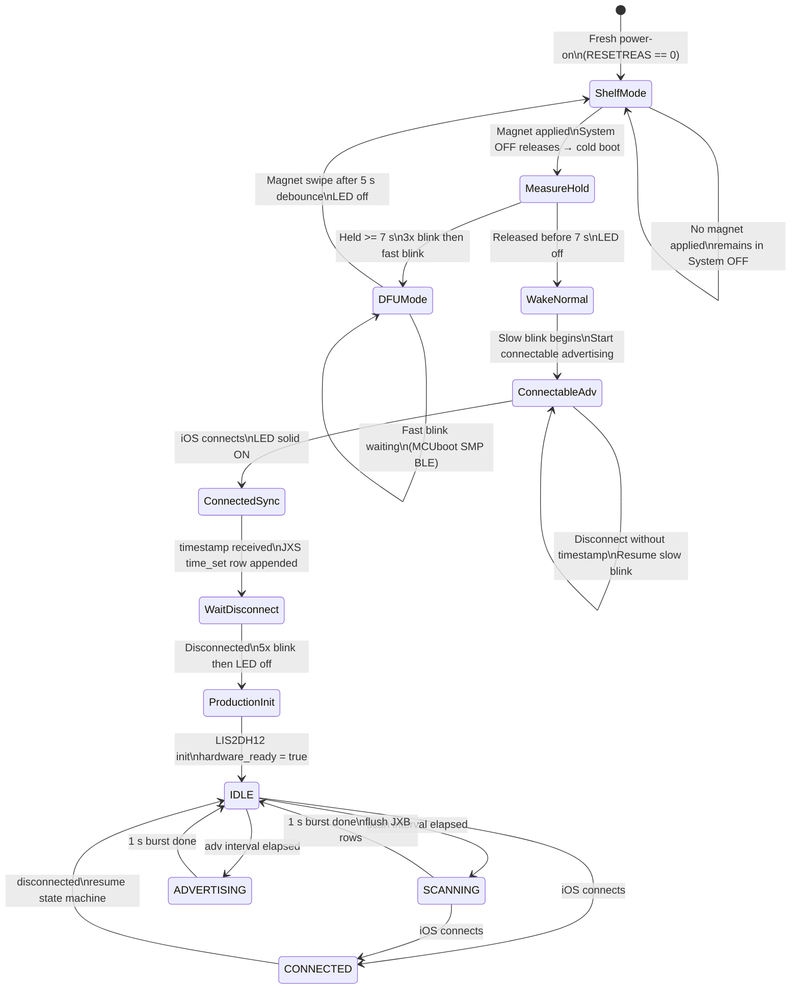

# juxta5-8-prod

Production Hublink firmware for Juxta5-8 (nRF52840). Combines Hublink GATT BLE, append-only NOR CSV logging, and LIS2DH12 motion/temperature sensing. Settings persist in nRF52840 internal flash. **BLE radiated TX** defaults to **+8 dBm** via `CONFIG_BT_CTLR_TX_PWR_ANTENNA` in the [`Juxta5-8_nRF52840`](../../boards/NeurotechHub/Juxta5-8_nRF52840/Juxta5-8_nRF52840_defconfig) board defconfig (when Bluetooth is enabled in the build).

Repository overview and bring-up apps: [`README.md`](../../README.md). NOR CSV field definitions: [`docs/JUXTA_NOR_Flash_Logging_Spec_v3.md`](../../docs/JUXTA_NOR_Flash_Logging_Spec_v3.md).

## Build and flash

```bash
west build -b Juxta5-8_nRF52840 applications/juxta5-8-prod
west flash
```

RTT console is the primary runtime log (`CONFIG_USE_SEGGER_RTT=y`). Optional: enable JXGA opportunistic gateway advertising at compile time with `-DJUXTA_PROD_ENABLE_JXGA_GATEWAY_ADV=1` (see [Pending](#pending--not-yet-implemented)).

## Defaults (NVS, first boot)

| Setting | Default | Range / notes |
| --- | --- | --- |
| `scan_interval_s` | 30 s | 0 = no passive scan; 1–120 s (clamped on save) |
| `adv_interval_s` | 5 s | 0 = no non-connectable adv; 1–120 s |
| `vitals_interval_s` | 60 s | Vitals timer period |
| `inactivity_multiplier` | 1 | 1–10; scales scan interval after zero-motion vitals window |
| `subject_id` | `JX_XXXXXX` (device ID) | Gateway `subjectId` may override |
| `experiment` | empty | Gateway `experiment` |
| `upload_path` | `/` | Fixed placeholder in NVS blob |

Firmware version **`5.8.0`**; NOR schema **`jxta-nor-csv-v5`** (`JUXTA_LOGGING_VERSION` 5).

---

## Boot and State Machine

### Boot path

```
Power-on / Reset
      │
      ├─ RESETREAS == 0 (fresh power-on)
      │         └─→ Shelf mode (System OFF, MAG_INT wake). No LED.
      │
      ├─ RESETREAS[OFF] set (woke from System OFF via magnet)
      │         └─→ LED ON while magnet held → measure hold duration
      │                   ├─ < 7 s  → LED off → slow blink → Datetime sync phase
      │                   └─ ≥ 7 s  → 3× blink → fast blink → DFU mode (MCUboot SMP BLE)
      │
      └─ Other (watchdog, pin reset, lockup)
                └─→ Skip shelf/hold, go straight to production init. No LED gate.

After datetime sync (if required), production init requires NOR log + LIS2DH12:
      ├─ NOR or accel init OK  → vitals + scan/adv state machine
      └─ NOR or accel init fail → long blink (1 s on / 1 s off) forever
```

### Datetime sync phase (normal wake only)

```
Slow blink (50 ms ON / 450 ms OFF) — waiting for iOS connection
      │
      └─ iOS connects
               │  LED: solid ON
               ├─ timestamp received via Gateway
               │         └─ wait for disconnect
               │                   └─ 5× blink → LED off → Production init
               │
               └─ disconnect without timestamp
                         └─ slow blink → restart connectable advertising
                                         (loops indefinitely until timestamp received)
```

### Production state machine

```
IDLE
 ├─ scan interval elapsed  → SCANNING (1 s passive burst) → flush JXB rows → IDLE
 ├─ adv interval elapsed   → ADVERTISING (1 s non-conn) → IDLE
 └─ iOS connects           → CONNECTED (radio owned by BT stack)
                                     └─ disconnect → IDLE

(JXGA_ overheard in scan → 30 s connectable “gateway” adv: **disabled** in default build;
re-enable with `-DJUXTA_PROD_ENABLE_JXGA_GATEWAY_ADV=1` or define the macro to 1 in `main.c`.)

Parallel vitals timer (every vitals_interval_s):
  LIS2DH12 temp + SAADC batt_mv + motion count → append JXV row
```

### Scanning vs advertising (operational BLE)

After **production init** (`hardware_ready`), the device never runs **non-connectable advertising** and **passive scanning** at the same time. `**adv_interval_s`** and `**scan_interval_s`** are **any whole-second integer from 0 to 120** (no stepping): **0** turns off that modality; values **> 120** are clamped to **120** when saved. **Opportunistic connectable advertising** after overhearing a `**JXGA_`** name is **disabled** by default (`JUXTA_PROD_ENABLE_JXGA_GATEWAY_ADV` = 0 unless overridden at compile time; default in `[src/main.c](src/main.c)`). A `**k_timer`** (`state_timer`) wakes a `**k_work`** handler (`state_work_handler`) on a schedule; each invocation **tears down** whatever phase was active (stop adv and/or stop scan), returns to an internal **IDLE** bookkeeping state, then optionally starts **one** new phase.

**Phases (mutually exclusive on the radio during normal operation)**


| Phase                                            | What starts                                                                   | How long (`state_timer`)      | Purpose                                                                                                                                                                       |
| ------------------------------------------------ | ----------------------------------------------------------------------------- | ----------------------------- | ----------------------------------------------------------------------------------------------------------------------------------------------------------------------------- |
| **Non-connectable advertising**                  | `start_nonconn_adv()` — fast interval, name in AD only                        | `ADV_BURST_MS` (**1000 ms**)  | Broadcast `JX_…` identity so other Juxta units can see us                                                                                                                     |
| **Passive scanning**                             | `start_scanning()` — stops any adv first, 100 ms gap, then `bt_le_scan_start` | `SCAN_BURST_MS` (**1000 ms**) | Listen for peer `JX_…` names; queue events for **JXB** logging after the burst                                                                                                |
| **Connectable “gateway” advertising** (optional) | `start_connectable_adv()` (Hublink, full GATT)                                | `GATEWAY_ADV_MS` (**30 s**)   | When `JUXTA_PROD_ENABLE_JXGA_GATEWAY_ADV` is **1**: after a `**JXGA_`** name is overheard in scan, open a connectable window for an iOS gateway. **Default build: disabled.** |


**Non-connectable advertising burst details** (see `start_nonconn_adv()` and `ADV_BURST_MS` in `[src/main.c](src/main.c)`):


| Parameter                                        | Value                                 | Notes                                                                                                                                                                                                 |
| ------------------------------------------------ | ------------------------------------- | ----------------------------------------------------------------------------------------------------------------------------------------------------------------------------------------------------- |
| Burst wall time                                  | **1000 ms**                           | `ADV_BURST_MS`; `state_timer` stops non-connectable advertising after this window, then returns to **IDLE**.                                                                                          |
| Cadence between non-connectable bursts           | `**adv_interval_s`** (NVS / Gateway)  | **0** = disabled; otherwise **1–120** s (any integer); compared against `last_adv_ts` in whole seconds (`juxta_time_now()`). Scan vs adv scheduling and jitter still apply as in the paragraph below. |
| Cadence between passive scan bursts              | `**scan_interval_s`** (NVS / Gateway) | **0** = disabled; otherwise **1–120** s (any integer); compared against `last_scan_ts` in whole seconds (`juxta_time_now()`).                                                                         |
| BLE advertising event spacing (inside the burst) | **100–150 ms**                        | `interval_min` / `interval_max` = `BT_GAP_ADV_FAST_INT_MIN_2` / `BT_GAP_ADV_FAST_INT_MAX_2` (Zephyr `gap.h`: **0x00A0** / **0x00F0** in 0.625 ms units → **100 ms** / **150 ms** nominal).            |
| AD payload                                       | `BT_DATA_NAME_COMPLETE`               | Local name `JX_…` (`adv_name`); non-connectable, identity-only burst for peer discovery.                                                                                                              |


**When both “due”, scan wins.** After going IDLE, the handler evaluates `**scan_due`** only if `**scan_interval_s` ≠ 0** (`juxta_time_now()` ≥ `last_scan_ts` + effective `**scan_interval_s`**), then `**adv_due`** only if `**adv_interval_s` ≠ 0** (≥ `last_adv_ts` + `**adv_interval_s`**). If both intervals are 0, periodic scan and non-connectable advertising are skipped and the state timer is not armed for them (connectable use cases unchanged). If `JUXTA_PROD_ENABLE_JXGA_GATEWAY_ADV` is enabled, `**do_gateway_adv`** (set when a scanned name begins with `**JXGA_**`) is evaluated **before** `scan_due` / `adv_due`. If nothing applies, it programs the timer for the **earlier** of the next enabled scan vs adv deadline, plus a small **random jitter** (0–999 ms) to desynchronize colliding devices.

**Timing note:** `scan_due` / `adv_due` use `**juxta_time_now()` in whole seconds**, `; `**ADV_BURST_MS`** and `**SCAN_BURST_MS`** are both **1 s** wall-time bursts scheduled sequentially, not divisors of the interval. **Idle-period jitter** (0–999 ms on the next sleep) spreads peer wakeups when many devices use similar intervals; it does not randomize burst lengths.

**While an iOS client is connected** (`ble_connected`), the work handler **returns immediately** — the stack owns the connection; scan/adv cycling resumes from **IDLE** after disconnect (see `on_disconnected` in the same file).

**Magnet shelf path:** if the user holds the magnet (not connected), firmware stops adv and scan, forces **IDLE**, then enters shelf after the debounce sequence — same “radio off before shelf” idea.

### Measured current draw (battery terminals)

Average current **probed at the battery terminals** (µA). Bench setup: **+8 dBm** TX where noted (`CONFIG_BT_CTLR_TX_PWR_ANTENNA` on this board); values depend on supply, RF environment, and build. **Est. 40 mAh lifetime** assumes a **40 mAh** LiPo and continuous drain at the stated average: **40 000 ÷ I_µA** hours (then shown as days or hours for readability). Does not include self-discharge, end-of-life voltage, or duty-cycle nuance on sub-minute burst rows. **Scan‑burst rows** below used **3** s `SCAN_BURST_MS` at measurement time; firmware now uses **1** s—expect lower average current (re‑bench to refresh numbers).


| Scenario                               | Conditions¹                                                                          | Rec. (s) | Avg (µA) | Est. 40 mAh lifetime |
| -------------------------------------- | ------------------------------------------------------------------------------------ | -------- | -------- | -------------------- |
| Shelf (System OFF)                     | `scan_interval_s` / `adv_interval_s` = 0 / 0, no radio                               | 10       | 8.685    | 192 d (4610 h)       |
| Idle production (no periodic scan/adv) | Periodic scan/adv disabled (0/0), **not** System OFF — LIS2DH12 + vitals path active | 60       | 30.9235  | 54 d (1293 h)        |
| Non-connectable adv burst only         | 1 s non-conn adv window, no scan                                                     | 1        | 155.637  | 257 h (10.7 d)¹      |
| Passive scan burst only                | 3 s passive scan, no adv                                                             | 3        | 2801.27  | 14.3 h (0.6 d)       |
| Balanced routine                       | Scan every **30** s, adv every **5** s (3 s scan burst, 1 s adv burst)               | 120      | 276.353  | 145 h (6.0 d)¹       |
| Low-duty routine                       | Scan every **60** s, adv every **20** s (3 s / 1 s bursts)                           | 120      | 186.376  | 215 h (8.9 d)¹       |
| High-duty routine                      | Scan every **10** s, adv every **1** s (3 s / 1 s bursts)                            | 120      | 707.859  | 56.5 h (2.4 d)¹      |


¹Production `SCAN_BURST_MS` / `ADV_BURST_MS` in `[src/main.c](src/main.c)`: **1** s passive scan and **1** s non-conn adv bursts. Interval columns in routine rows are NVS / gateway `scan_interval_s` and `adv_interval_s`. Tabulated **Avg (µA)** predates **1** s scan/adv windows (captured with **3** s scan and **0.5** s adv bursts)—re-bench to refresh.

---

## State Machine Diagram




---

## LED patterns (LED0, P0.09)

`CONFIG_NFCT_PINS_AS_GPIOS=y`. Patterns are driven by a kernel timer + work item in [`src/main.c`](src/main.c).


| Pattern | Timing | When |
| --- | --- | --- |
| **Off** | — | Shelf (no magnet), production idle, after successful sync handoff |
| **Solid ON** | — | Magnet held at wake; BLE connected |
| **Slow blink** | 50 ms on / 450 ms off | Datetime sync: connectable advertising, waiting for iOS |
| **Fast blink** | 50 ms on / 50 ms off | DFU mode (magnet hold ≥ 7 s) |
| **Long blink** | **1 s on / 1 s off** (indefinite) | **Hardware fault**: external NOR log init failed, or LIS2DH12 init failed — device does not enter production |
| **Counted blinks** | 3× (DFU entry), 5× (sync OK, magnet shelf) | One-shot sequences via `led_blink()` |


### Hardware fault indication (long blink)

If **SPI NOR** logging cannot initialize (`juxta_log_init`, e.g. flash not ready, recovery/format failure) or the **LIS2DH12** cannot initialize (`init_accel`, SPI, motion IRQ, or interrupt config), firmware logs an error on RTT and enters **`LED_MODE_LONG_BLINK`**: **1 second on, 1 second off**, repeating forever. Production timers, vitals, and the scan/adv state machine **do not** start (`hardware_ready` stays false). The watchdog continues to be fed (10 s period). Power cycle or debug reset is required to retry.

This is distinct from **slow blink** (datetime sync) and **fast blink** (DFU).

---

## Magnet Gesture Reference


| Gesture                                       | LED feedback                     | Effect                                                    |
| --------------------------------------------- | -------------------------------- | --------------------------------------------------------- |
| Apply at any time (device in shelf mode)      | LED ON immediately               | Wakes device from System OFF → cold boot                  |
| Release < 7 s after cold boot                 | LED off → slow blink (50/450 ms) | Gateway advertising mode; waits for datetime sync         |
| Hold ≥ 7 s after cold boot                    | 3× blink → fast blink (50/50 ms) | DFU mode; 5 s debounce then magnet swipe returns to shelf |
| Any connect event                             | Solid ON                         | Active BLE connection                                     |
| Disconnect after valid timestamp              | 5× blink → LED off               | Production init begins                                    |
| Disconnect without timestamp                  | Slow blink resumes               | Restarts connectable advertising                          |
| Magnet swipe during DFU fast-blink            | LED off                          | Returns device to shelf mode                              |
| Magnet held during production (not connected) | 5× blink → LED off               | 5 s debounce then shelf mode                              |
| NOR or accelerometer init failure             | Long blink (1 s / 1 s)           | Fault loop; no production operation                       |

---

## Hublink Gateway Data Exchange

All BLE communication uses the **Hublink service** (`57617368-5501-0001-8000-00805f9b34fb`).

### Characteristics


| Characteristic | UUID suffix | Permissions             | Description                                 |
| -------------- | ----------- | ----------------------- | ------------------------------------------- |
| Node           | `...5505`   | READ                    | JSON device status; read once after connect |
| Gateway        | `...5504`   | WRITE / WRITE NO RSP    | JSON command from iOS to device             |
| Filename       | `...5502`   | READ / WRITE / INDICATE | File listing and file selection             |
| File Transfer  | `...5503`   | READ / INDICATE / CCC   | Chunked file payload                        |


---

### Node characteristic (READ → iOS)

Single JSON object. iOS reads this once on connect. Keys are **camelCase**. `firmwareVersion` must begin with `**5.8**` or the companion app disconnects.

```json
{
  "firmwareVersion": "5.8.0",
  "batteryLevel": 87,
  "memoryLevel": 12,
  "deviceId": "JX_9B10A1",
  "subjectId": "JX_9B10A1",
  "experiment": "",
  "advInterval": 5,
  "scanInterval": 30,
  "inactivityMultiplier": 1
}
```


| Field                    | Type             | Description                                                                                                                                                                                                                                                         |
| ------------------------ | ---------------- | ------------------------------------------------------------------------------------------------------------------------------------------------------------------------------------------------------------------------------------------------------------------- |
| `firmwareVersion`        | string           | Semantic version; must start with `**5.8**` for the iOS app                                                                                                                                                                                                         |
| `batteryLevel`           | integer 0–100    | Percent from SAADC (3.0 V = 0 %, 4.2 V = 100 %)                                                                                                                                                                                                                     |
| `memoryLevel`            | integer 0–100    | Approximate NOR log fill across JXS+JXV+JXB regions                                                                                                                                                                                                                 |
| `deviceId`               | string           | Stable hardware ID `JX_XXXXXX` (last 3 identity bytes)                                                                                                                                                                                                              |
| `subjectId`              | string           | NVS subject; Gateway may set via `subjectId` on write                                                                                                                                                                                                               |
| `experiment`             | string           | NVS experiment (empty until set via Gateway)                                                                                                                                                                                                                        |
| `advInterval`            | integer          | **0** = disable non-connectable advertising; otherwise **1–120** s, any integer (NVS + Gateway; values **> 120** clamped on save)                                                                                                                                   |
| `scanInterval`           | integer          | **0** = disable passive scan bursts; otherwise **1–120** s, any integer (NVS + Gateway; values **> 120** clamped on save)                                                                                                                                           |
| `inactivityMultiplier`   | integer **1–10** | When **> 1**, passive **scan** cadence uses `**scan_interval_s` × multiplier** (capped at **120** s) if the last vitals window had zero LIS2DH12 motion events; `**1**` = no stretch. Does **not** change `adv_interval_s`. Ignored when `scan_interval_s` is **0** |


---

### Gateway characteristic (WRITE → device)

JSON object; any subset of keys may be sent. Unrecognized keys are ignored. All keys are **camelCase**. Settings writes may omit `experiment` when empty.

```json
{
  "timestamp": 1717003200,
  "sendFilenames": true,
  "clearMemory": true,
  "reset": true,
  "subjectId": "001",
  "experiment": "trial-A",
  "advInterval": 5,
  "scanInterval": 20,
  "inactivityMultiplier": 1,
  "vitalsInterval": 60
}
```


| Field                    | Type                | Effect                                                                                                                                            |
| ------------------------ | ------------------- | ------------------------------------------------------------------------------------------------------------------------------------------------- |
| `timestamp`              | uint32 Unix seconds | Sets device clock; appends `time_set` row to JXS                                                                                                  |
| `sendFilenames`          | bool                | Triggers file listing indication on Filename characteristic                                                                                       |
| `clearMemory`            | bool                | Erases all NOR CSV regions; fresh daily files on next write; appends `memory_cleared` to JXS; **does not clear NVS settings**                     |
| `reset`                  | bool                | Immediately enters shelf mode (System OFF in production; soft reboot in debug)                                                                    |
| `scanInterval`           | integer (seconds)   | Stored in NVS: **0** = no passive scan bursts; otherwise **1–120**, any integer (out-of-range values clamped); appends `settings_changed` to JXS  |
| `advInterval`            | integer (seconds)   | Stored in NVS: **0** = no non-connectable advertising; otherwise **1–120**, any integer (out-of-range values clamped); appends `settings_changed` |
| `vitalsInterval`         | integer (seconds)   | Vitals timer period; stored in NVS; appends `settings_changed`                                                                                    |
| `inactivityMultiplier`   | integer **1–10**    | Stored in NVS; scales **scan** interval after a vitals window with no motion (see Node table)                                                     |
| `subjectId`              | string              | Subject assignment; stored in NVS; appends `settings_changed` to JXS                                                                              |
| `experiment`             | string              | Experiment string; stored in NVS; appends `settings_changed` to JXS                                                                               |


---

### File listing (Filename characteristic)

Triggered by `"sendFilenames": true` in a Gateway write, or by writing `"LIST"` to the Filename characteristic directly. The device sends an **indication** with a semicolon-separated list:

```
JXS20260507.csv|2048;JXV20260507.csv|14592;JXB20260507.csv|30720
```

Each entry is `filename|size_in_bytes`. **Size** is the **CSV payload** byte count on File Transfer (no leading filename line, no NOR `#EOF` line in that count). A separate **standalone** File Transfer indication with payload `**EOF`** (3 ASCII bytes) follows all data indications and is **not** included in **size**.

---

### File transfer protocol (File Transfer characteristic)

1. iOS writes the desired filename to the **Filename** characteristic (e.g. `JXV20260507.csv`).
2. The device streams the file as a sequence of **indications** on the **File Transfer** characteristic.
  - Data payloads are **CSV only**: the first line stored on NOR (`filename.csv`) is skipped; indications start at the CSV header row. The NOR `#EOF` line is **not** sent as file bytes.
  - Each data indication payload is up to `min(MTU − 3, 512)` bytes (last chunk may be short).
  - The device waits for each indication confirmation before sending the next chunk.
3. After all data chunks, the peripheral sends **one** final indication on File Transfer whose value is exactly the string `**EOF`** (three bytes — gateway end-of-transfer marker). This is distinct from the Filename listing terminator `EOF` and from the `#EOF` line stored on NOR when a file closes.
4. iOS should request MTU exchange to 247 bytes for optimal throughput (~244 bytes per data indication).

---

## NOR Flash Layout

Logging schema **`jxta-nor-csv-v5`** ([`src/juxta_prod.h`](src/juxta_prod.h)). JXS event rows include **`adv_interval_s`** (after `scan_interval_s`). JXV vitals files carry a per-file NVS snapshot in two `#device_settings` comment lines immediately after the column header.

| Region | Address               | Size  | Content               |
| ------ | --------------------- | ----- | --------------------- |
| JXS    | `0x000000 – 0x00FFFF` | 64 KB | Settings / events log |
| JXV    | `0x010000 – 0x10FFFF` | 1 MB  | Vitals log            |
| JXB    | `0x110000 – 0x3FFFFF` | 3 MB  | BLE observations log  |


All regions are append-only CSV. Each pseudo-file is physically stored as:

```
JXSYYYYMMDD.csv
unix,event,device_id,subject_id,experiment,fw_version,scan_interval_s,adv_interval_s,vitals_interval_s,ble_name
1715200000,boot,JX_9B10A1,JX_9B10A1,,5.8.0,30,5,60,JX_9B10A1
```

```
JXVYYYYMMDD.csv
unix,motion,batt_v,temp_c
#device_settings,subject_id,experiment,scan_interval_s,adv_interval_s,vitals_interval_s,inactivity_multiplier
#device_settings,JX_9B10A1,,30,5,60,1
1715200000,12,3.81,24
#EOF
```

Each new JXV file appends two **`#device_settings`** comment lines (current NVS when the file was opened) after the column header so vitals files stay interpretable without hunting older JXS for intervals or subject.

```
JXBYYYYMMDD.csv
unix,observer_id,peer_id,rssi
1715200000,JX_9B10A1,JX_3FA2B7,-62
#EOF
```

Settings and the log-state cache live in nRF52840 internal flash (`storage_partition` at `0xF0000`, 64 KB) via Zephyr NVS.

---

## Validation checklist

Hardware + iOS session (also summarized in the repo [`README.md`](../../README.md)):

1. Flash `juxta5-8-prod` for `Juxta5-8_nRF52840`; RTT shows device ID, NVS load, NOR init, JXS `boot` row.
2. Connect (nRF Connect or iOS). Node READ returns camelCase JSON; `firmwareVersion` starts with `5.8`.
3. Gateway `{"timestamp":…}` → `time_set` in JXS.
4. Gateway `{"sendFilenames":true}` → Filename indication lists `JXS|…;JXV|…;JXB|…`.
5. Write a filename → File Transfer CSV stream (payload size matches listing) → final 3-byte `EOF` indication.
6. Wait one vitals period → JXV grows; open a new day’s JXV (or after `clearMemory`) and confirm `#device_settings` lines after the header.
7. Second `JX_XXXXXX` nearby during scan → JXB rows in RTT / NOR.
8. Gateway `{"clearMemory":true}` → NOR erased, `memory_cleared` event; NVS settings unchanged on reconnect.
9. Power cycle → NVS settings and log cache reconcile without full NOR rescan.

---

## File Structure

```
applications/juxta5-8-prod/
├── CMakeLists.txt
├── prj.conf
├── sample.yaml
├── README.md            ← this file
└── src/
    ├── main.c           ← boot sequence, magnet hold, shelf mode, state machine
    ├── ble_service.c/h  ← Hublink GATT (Node/Gateway/Filename/FileTransfer)
    ├── juxta_log.c/h    ← NOR CSV append, list, read, recover
    ├── juxta_settings.c/h ← NVS-backed current settings + log-state cache
    ├── juxta_time.c/h   ← Unix timestamp set/get, date string formatter
    └── juxta_prod.h     ← shared constants (version, sizes, defaults)
```

---

## Implementation Status and Remaining Work

### Implemented


| Feature                     | Notes                                                                                                                                                                                                                                                                                                                                                                                                                                                                                                                                                |
| --------------------------- | ---------------------------------------------------------------------------------------------------------------------------------------------------------------------------------------------------------------------------------------------------------------------------------------------------------------------------------------------------------------------------------------------------------------------------------------------------------------------------------------------------------------------------------------------------- |
| Shelf mode (System OFF)     | Fresh boot, brownout, Gateway `reset`, production magnet hold, DFU swipe → `prepare_for_shelf_mode()` (stop timers, disconnect BLE, LIS2DH12 power-down) then `sys_poweroff()`; MAG_INT `GPIO_INT_LEVEL_LOW` wake source                                                                                                                                                                                                                                                                                                                               |
| Magnet hold measurement     | < 7 s → normal wake, ≥ 7 s → DFU path                                                                                                                                                                                                                                                                                                                                                                                                                                                                                                                |
| LED mode state machine      | `OFF`, `ON` (connected), `SLOW_BLINK` (50/450 ms, datetime sync), `FAST_BLINK` (50/50 ms, DFU), `LONG_BLINK` (1 s / 1 s, NOR or LIS2DH12 init failure) driven by kernel timer + work item                                                                                                                                                                                                                                                                                                                                                              |
| Hardware fault indication   | `juxta_log_init` or `init_accel` failure → RTT error + indefinite **long blink**; production not started                                                                                                                                                                                                                                                                                                                                                                                                                                                |
| LED blink sequences         | Magnet hold: solid ON; DFU entry: 3× 200 ms blink; production init: 5× 50 ms blink                                                                                                                                                                                                                                                                                                                                                                                                                                                                   |
| Datetime sync gate          | Connectable adv after normal wake; loops indefinitely until timestamp received; must have timestamp before production init                                                                                                                                                                                                                                                                                                                                                                                                                           |
| Watchdog                    | 30 s window, fed every 10 s, pauses on debug halt                                                                                                                                                                                                                                                                                                                                                                                                                                                                                                    |
| NVS settings                | `subject_id`, `experiment`, `scan_interval_s`, `vitals_interval_s`, `adv_interval_s`, `inactivity_multiplier` **1–10** (plus `upload_path` slot always written as `**/**`; reserved bytes for legacy blob layout)                                                                                                                                                                                                                                                                                                                                    |
| NOR CSV logging             | JXS events, JXV vitals, JXB BLE observations; append-only, `#EOF` on close                                                                                                                                                                                                                                                                                                                                                                                                                                                                           |
| Daily file rotation         | `ensure_file()` in `[src/juxta_log.c](src/juxta_log.c)`: when the calendar date from `unix_time` no longer matches the active pseudo-file, the previous file is closed with `#EOF` and a new `*yyyymmdd.csv` is created. On each new **calendar day**, the first JXS/JXV/JXB append runs `touch_all_for_calendar_day()` so **all three** types get a dated file for that day (header + schema row only if there are no data rows yet; **JXV** also writes two `#device_settings` NVS snapshot lines after the schema), giving the gateway a consistent triple per day. Requires a valid clock; old files remain until Gateway `clearMemory` |
| Log-state cache             | MCU NVS caches file offsets; scans NOR on cache miss                                                                                                                                                                                                                                                                                                                                                                                                                                                                                                 |
| BLE state machine           | Non-connectable advertising when `adv_interval_s` is **1–120** s, any integer (**0** = off); passive scan bursts when `scan_interval_s` is **1–120** s, any integer (**0** = off; effective scan interval `**scan_interval_s` × `inactivity_multiplier**` when multiplier **> 1** and last vitals window had no motion, capped at **120** s); JXGA_ opportunistic connectable adv **disabled** in source (`JUXTA_PROD_ENABLE_JXGA_GATEWAY_ADV`)                                                                                                      |
| Battery level in Node JSON  | SAADC mV sampled on connect and each vitals tick; calibrated factor 7.96×; linear 3.0–4.2 V → 0–100 %                                                                                                                                                                                                                                                                                                                                                                                                                                                |
| Battery safeguards          | Brownout < **2.75** V → shelf mode (boot + vitals timer, logs `low_battery`); DFU gate < 3.2 V → falls back to normal wake                                                                                                                                                                                                                                                                                                                                                                                                                           |
| Hublink GATT service        | Node, Gateway, Filename, File Transfer characteristics; UUIDs match iOS companion                                                                                                                                                                                                                                                                                                                                                                                                                                                                    |
| DFU (MCUboot SMP BLE)       | Long magnet hold: `bt_enable`, SMP advertising, nRF Device Manager; magnet swipe → shelf                                                                                                                                                                                                                                                                                                                                                                                                                                                             |
| Node JSON                   | Spec keys: `firmwareVersion`, `batteryLevel`, `memoryLevel`, `deviceId`, `subjectId`, `experiment`, `advInterval`, `scanInterval`, `inactivityMultiplier`                                                                                                                                                                                                                                                                                                                                                                                    |
| Gateway commands            | `timestamp`, `sendFilenames`, `clearMemory`, `reset`, `scanInterval`, `advInterval`, `vitalsInterval`, `subjectId`, `experiment`, `inactivityMultiplier`                                                                                                                                                                                                                                                                                                                                                    |
| BLE connection optimisation | MTU exchange initiated on connect; supervision timeout 4 s; preferred interval 30–50 ms via `bt_conn_le_param_update`                                                                                                                                                                                                                                                                                                                                                                                                                                |
| Production magnet-to-shelf  | Magnet held in production (not connected) → 5× blink → 5 s debounce → shelf mode                                                                                                                                                                                                                                                                                                                                                                                                                                                                     |
| Debugger simulation loop    | `CoreDebug->DHCSR` detects J-Link; simulates shelf/wake/DFU cycle in-band; `sys_reboot()` restarts loop                                                                                                                                                                                                                                                                                                                                                                                                                                              |
| Vitals logging              | LIS2DH12 temperature, SAADC battery voltage, motion count → JXV; motion snapshot also drives inactivity **scan** interval multiplier                                                                                                                                                                                                                                                                                                                                                                                                                 |
| BLE observation logging     | `JX_XXXXXX` peer detection → JXB rows with observer/peer/rssi                                                                                                                                                                                                                                                                                                                                                                                                                                                                                        |
| JXS provenance rows         | `boot`, `time_set`, `settings_changed`, `user_connected`, `user_disconnected`, `memory_cleared`, `low_battery`                                                                                                                                                                                                                                                                                                                                                                                                                                       |
| File listing wire format    | `name\|size;name\|size;…` indication; listing **size** is CSV payload only (no filename line, no `#EOF`); transfer ends with 3-byte `EOF` indication on File Transfer                                                                                                                                                                                                                                                                                                                                                                                |
| JXV settings snapshot       | On each new JXV pseudo-file: two `#device_settings` CSV comment lines (subject, experiment, scan/adv/vitals intervals, inactivity multiplier) after schema row                                                                                                                                                                                                                                                                                                                                                                                       |
| FUEL pin correction         | FUEL on P0.30/AIN6 (was incorrectly mapped to P0.28/AIN4 = AXY_INT2)                                                                                                                                                                                                                                                                                                                                                                                                                                                                                 |


### Pending / Not Yet Implemented


| Feature                             | Notes                                                                                                                                                                                                                                                                      |
| ----------------------------------- | -------------------------------------------------------------------------------------------------------------------------------------------------------------------------------------------------------------------------------------------------------------------------- |
| **JXGA_ opportunistic gateway adv** | Post–ProductionInit connectable advertising after overhearing `JXGA`_* in scan is **compiled out** (`JUXTA_PROD_ENABLE_JXGA_GATEWAY_ADV` = 0). Re-enable with `-DJUXTA_PROD_ENABLE_JXGA_GATEWAY_ADV=1` or by defining the macro to **1** before the `#ifndef` in `main.c`. |


